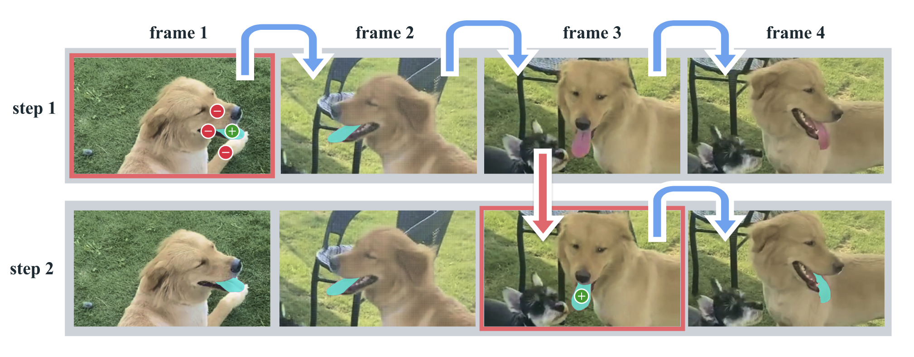

# Task

- Promptable Visual Segmentation (PVS) task

- Task starts by taking point, box, mask as input on any frame of the video to identify ROI

- Then 'masklet' (spatio-temporal mask) is predicted  

- After this, provide more prompt on other frame to refine this mask iteratively

- Step 1: Selection

    give dots as prompt in frame 1, green - positive, red - negative. SAM2 can automatically track and segment ROI in the following frames. 

- Step 2: Refinement

    If the object is lost, can give another simpler prompt to hint it back (just one click in the lost frame), more efficient

# Model

- Handle both images and videos

- Main innovation:

    - A memory that stores information about the object and the previous interaction

    - Memory Attention module to attend to the previous memories of target object

    - When it is applied to image, the memory is empty, the model behave like SAM

- Promptable and light weighted-mask decoder accepts a frame embedding and a prompt on the current frame, and segment the mask for the frame.

- The frame embedding used by SAM2 decoder is conditioned on the memories of the past predictions and prompted frames

- Memories of frames are created by the memory encoder based on the current prediction and placed in a memory bank for use in subsequent frames.

- The memory attention operation takes the per-frame embedding from the image encoder and conditions it on the memory bank to produce an embedding that is then passed to the mask decoder.

**Image Encoder**

- image encoder is only runned once for entire interaction

- provide feature embedding for each frame

- MAE pre-trained Hiera image encoder (hierachical)

**Memory Attention**

- To condition the current frame features on the past frame features, predictions and new prompt

- Input: Start with the image encoding of the current frame

- Transformer Blocks: Stack L transformer blocks to process the input

- Within Each Transformer Block:

    - Self-Attention: Computes attention within the current frame features to capture internal relationships

    - Cross-Attention attends to:

        - Memory bank (past frame features, predictions, and prompts)

        - Object pointers stored in the memory bank

    - MLP: Refines the attended features

- Uses vanilla self- and cross-attention operations

- Output conditioned features (with historical and contextual information) are passed to the next stage of the pipeline

**Prompt Encoder**

- Types:
    Point(positive and negative), bounding box, masks

- Process sparse prompt:

    - Each type of prompt is assigned a learned embedding, which acts like a unique identifier for that type of input

    - A positional encoding is added to these embeddings. Positional encoding provides the model with information about the location of the prompt within the frame

- Process mask prompt:

    - Masks are passed through a convolutional layer. This extracts features from the mask, helping the model understand its shape and position.

    - The extracted mask features are then summed with the frame’s features. This combines information about the mask with the frame itself, helping the model refine its understanding of the object.

**Mask Decoder**

- Stacks “two-way” transformer blocks to update both prompt and frame embeddings

- Ambiguity Handling:

    - For ambiguous prompts (i.e. a single click), multiple masks are predicted for possible target objects.

    - In video, ambiguity may persist across frames; multiple masks are predicted for each frame.

    - The model retains the mask with the highest predicted IoU if no follow-up prompts resolve ambiguity.

**Memory Encoder**

- To create a memory representation for each frame

- Downsamples the output mask using a convolutional module

- Element-wise add this mask to the unconditioned frame embedding generated by the image encoder

- Passes the combined result through lightweight convolutional layers to merge the information

**Memory Bank**

- To store and manage past information about the target object and prompts for the video

- Spatial Memory:

    - What It Stores:

        Detailed spatial feature maps containing:

        - Predictions about the target object from past frames

        - Information from user-provided prompts (e.g., clicks, bounding boxes).

    - How It’s Stored:

        Two FIFO queues (First-In-First-Out):

        - A queue for up to N recent unprompted frames, storing spatial feature maps for short-term memory

        - A queue for up to M prompted frames, storing spatial feature maps for frames with user-provided inputs
    
- Object Pointers:

    - small, lightweight data structures (vectors) that summarize high-level information about the object the model is segmenting

    - instead of storing all the detailed spatial features, these pointers store semantic information

    - derived from the mask decoder output for each frame (after the mask decoder predicts the segmentation for a frame, it also produces these object pointers, which encapsulate key details about the object)

    - each 256-dimensional object pointer is split into 4 tokens of 64 dimensions, making them more efficient for processing in cross-attention with the memory bank 

    - provide a compact way to represent the object, which helps the model keep track of it across frames

- Temporal Position Embedding:

    - adds temporal position information to memories of the N recent frames to represent short-term motion

    - excludes temporal embedding for prompted frames, as these may come from vastly different time periods during inference

**Training**

- Joint Training on Image and Video Data:

    Simulates interactive prompting to mimic real-world usage
    
    - Process:

        - Sample a sequence of 8 frames
        
        - Randomly select up to 2 frames as prompts and add corrective clicks based on:

            - Ground-truth masklet
            
            - Model predictions
        
        - Predict the ground-truth masklet sequentially and interactively for the remaining frames
        
    - Prompt Probabilities:
        
        - Initial prompts are chosen as:
            
            - Ground-truth mask (50% chance)
            
            - A positive click from the ground-truth mask (25% chance)
            
            - A bounding box input (25% chance)

# Dataset

- Generate training data by using the model in the loop and the annotators to interactively annotate challenging new data

**Data Engine**

# Experiment

## Metrics

# Innovation on my paper

- Add an anatomically aware attention block after text & point promt, before mask decoder

- This "shap prior" could be involved in the training process, just like memory bank, it can be refined more and more.

- Find Edge metrics to measure the performance

- The number of interaction (less) could also be one advantage during the time frame

- generazation ability on organs dataset with temporal info

