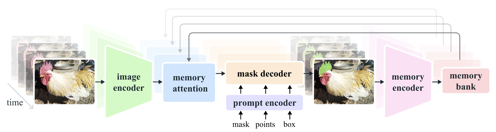

# Task

- Promptable Visual Segmentation (PVS) task

- Task starts by taking point, box, mask as input on any frame of the video to identify ROI

- Then 'masklet' (spatio-temporal mask) is predicted  

- After this, provide more prompt on other frame to refine this mask iteratively

- Step 1: Selection

    give dots as prompt in frame 1, green - positive, red - negative. SAM2 can automatically track and segment ROI in the following frames. 

- Step 2: Refinement

    If the object is lost, can give another simpler prompt to hint it back (just one click in the lost frame), more efficient

# Model

- Handle both images and videos

- Main innovation:

    - A memory that stores information about the object and the previous interaction

    - Memory Attention module to attend to the previous memories of target object

    - When it is applied to image, the memory is empty, the model behave like SAM

- Promptable and light weighted-mask decoder accepts a frame embedding and a prompt on the current frame, and segment the mask for the frame.

- The frame embedding used by SAM2 decoder is conditioned on the memories of the past predictions and prompted frames

- Memories of frames are created by the memory encoder based on the current prediction and placed in a memory bank for use in subsequent frames.

- The memory attention operation takes the per-frame embedding from the image encoder and conditions it on the memory bank to produce an embedding that is then passed to the mask decoder.

**Image Encoder**

**Memory Attention**

**Prompt Encoder and Mask Decoder**

**Memory Encoder**

**Memory Bank**

**Training**

# Dataset

- Generate training data by using the model in the loop and the annotators to interactively annotate challenging new data

**Data Engine**

# Experiment

## Metrics

# Innovation on my paper

- Add an anatomically aware attention block after text & point promt, before mask decoder

- This "shap prior" could be involved in the training process, just like memory bank, it can be refined more and more.

- Find Edge metrics to measure the performance

- The number of interaction (less) could also be one advantage during the time frame

- generazation ability on organs dataset with temporal info

