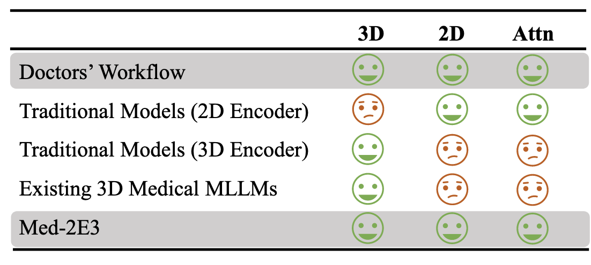
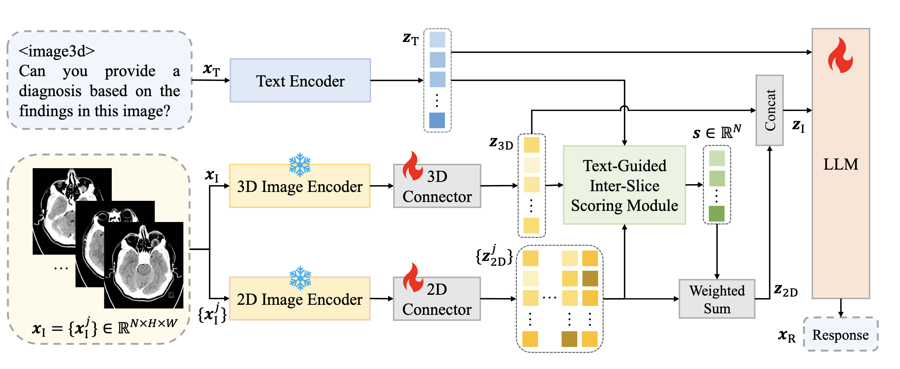
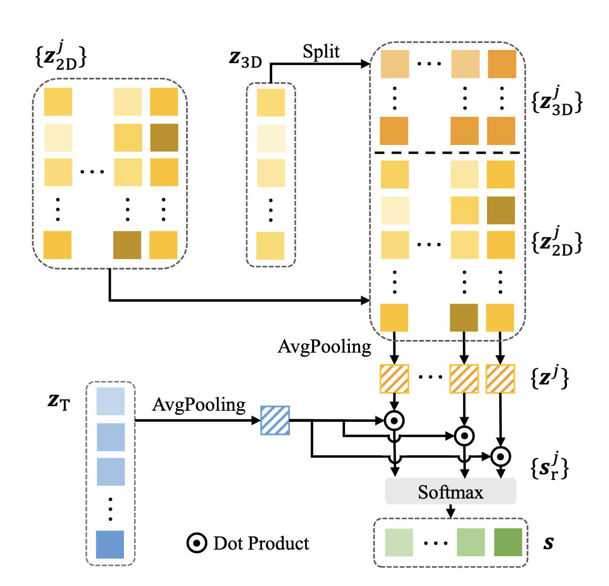
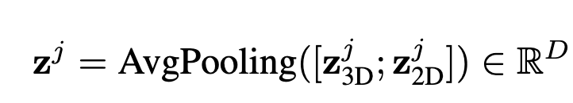
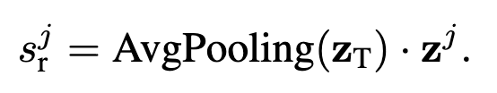
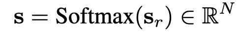
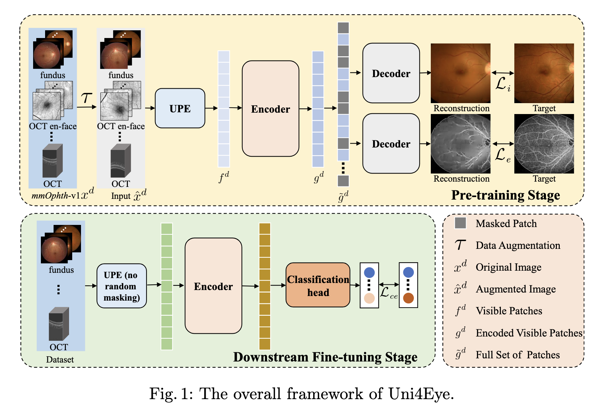
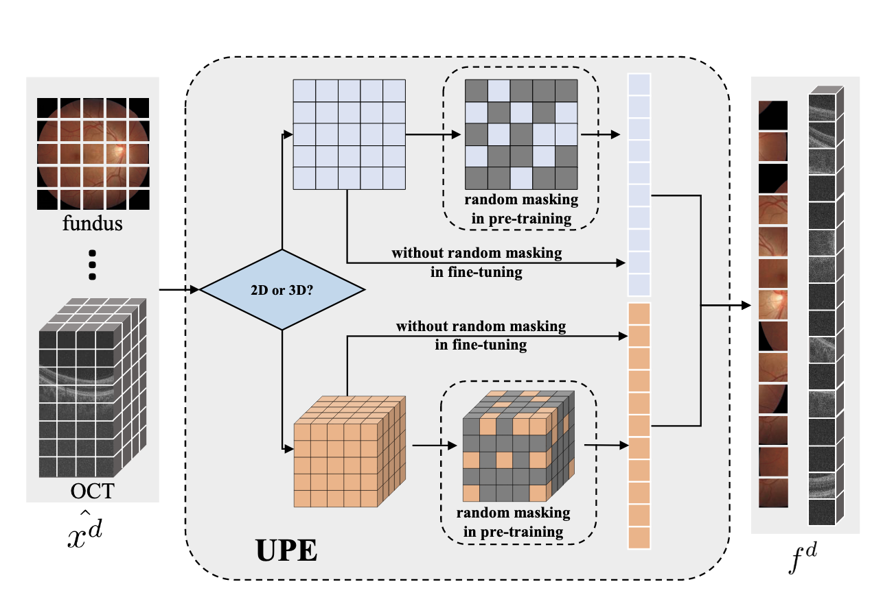

## [Med-2E3: A 2D-Enhanced 3D Medical Multimodal Large Language Model](https://arxiv.org/abs/2411.12783)

-  Inspiration: radiologists focus on both 3D spatial structure and
2D planar content, we propose Med-2E3, a novel MLLM
for 3D medical image analysis that integrates 3D and 2D
encoders. 

- input is 3D image $x_1$ and task instruction $x_T$

- output is a textual response $x_R$

- 3D and 2D encoders to extract complementary features ($z_{3D}$ and {$z^j_{2D}$}), respectively. 

- Attention scores $s ∈ R^N$ , calculated by the TG-IS scoring module, are used to aggregate 2D features, which are then concatenated with 3D features. 

- The 2D-enhanced 3D features $z_I$ are combined with text features $z_T$, and the resulting input is processed by LLMs to generate the response $x_R$

**Text-Guided Inter-Slice (TG-IS) Scoring Module**

- Score the attention of each slice based on its contents and task instructions

- Input Features

    - 3D Features ($z_{3D}$​):
        The serialized 1D features extracted from a 3D volume are reshaped into a 3D form, and relevant features for each slice ($z_j^{3D}$) are selected.
    - 2D Features ($z_j^{2D}$​):
        Features extracted from 2D slices of the volume.

- Feature Fusion

    - For each slice $j$, the 3D features ($z_j^{3D}$) and 2D features ($z_j^{2D}$) are concatenated and then aggregated using average pooling:
    
    - where $z_j$ represents the key feature vector for slice $j$, and $D$ is the feature dimension.

- Task-Specific Scoring

    - A textual instruction feature ($z_T$) represents the task or context provided to the model (e.g., "focus on left ventricle").

    - The relevance score ($s_j^r$) for each slice $j$ is computed as the dot product between:

        - $z_j$ (the fused features of slice $j$)
        - $z_T$ (task-specific textual features)

        

        - mimicking the way radiologists allocate varying levels of attention based on task requirements

- Attention Normalization

    - The relevance scores ($s^r$) for all slices are passed through a softmax function to normalize them into a probability distribution:
    
    - where $N$ is the number of slices. This produces the final attention score ($s$) for each slice.

## [PiMAE: Point Cloud and Image Interactive Masked Autoencoders for 3D Object Detection](https://openaccess.thecvf.com/content/CVPR2023/papers/Chen_PiMAE_Point_Cloud_and_Image_Interactive_Masked_Autoencoders_for_3D_CVPR_2023_paper.pdf?utm_source=chatgpt.com)

Relavant:

- MAE architecture that processes two different data modalities (point cloud and RGB image); promotes feature extraction, alignment, and fusion across the modalities

Modality-Specific Encoders:

- These are separate encoders for each data modality (one for 2D images and another for 3D point clouds).

- They specialize in extracting features unique to each modality without mixing information at this stage.

- Each branch uses a Vision Transformer (ViT) backbone to encode its specific modality's data.

- Inputs:

    - Two types of data (e.g., 2D images and 3D point clouds) are represented as tokens.
    These tokens are augmented with positional embeddings (to encode spatial structure) and modality embeddings (to encode the source modality).

- Processing:

    - The tokens are passed through separate ViT-based encoders:
        $E_I:T_I→L_I$​: The image-specific encoder maps visible image patch tokens ($T_I$​) to a latent space ($L_I^1$​).
        $E_P:T_P→L_P^1$​: The point-specific encoder maps visible point cloud tokens ($T_P$​) to a latent space ($L_P^1$​).

- Output:

    - Each encoder produces a modality-specific latent representation ($L_I^1$​ for images and $L_P^1$​ for points).

Cross-Modal Encoder:

- After modality-specific feature extraction, the features are combined and refined using a shared encoder.

- This encoder promotes feature fusion and facilitates interactions between the different modalities.

- Inputs:

    - The latent representations ($L_I^1$​ and $L_P^1$​) from the modality-specific encoders.
    These representations align token information to ensure that shared patches across the two modalities contain related features.

- Processing:

    - A shared encoder ($E_S$​) is used to perform feature fusion and interaction:
        $E_S:(L_I^1,L_P^1)→L_S^2$​: Combines the two latent spaces into a fused latent space ($L_S^2$​).

- Alignment:

    - Alignment of masks ensures that corresponding tokens represent the same underlying features across both modalities, such as the same object or region in 2D and 3D views.

- Output:

    - The cross-modal latent space ($L_S^2$​) encodes fused and aligned features from both modalities.

## [Uni4Eye: Unified 2D and 3D Self-supervised Pre-training via Masked Image Modeling Transformer for Ophthalmic Image Classification](https://arxiv.org/pdf/2203.04614)

- General: due to limited annotated data, the framework is designed to effectively utilize unlabeled 2D and 3D ophthalmic images to learn meaningful feature embeddings without requiring extensive manual annotations

- Relevant:  Unified Patch Embedding (UPE) module

    - employ a Unified Patch Embedding module to replace the origin patch embedding module in ViT for jointly processing both 2D and 3D input images

- Model Architecture:

    

    - The model first learns general features in the pre-training stage and then fine-tunes on specific tasks for better results

    - Pre-Training Stage (P):

        - The model is first pre-trained on two self-supervised tasks using Masked Image Modeling (MIM).
        - This stage helps the encoder learn general and discriminative features from different ophthalmic images.

    - Fine-Tuning Stage (D):

        - The pre-trained UPE module and ViT encoder are fine-tuned on various downstream tasks to improve performance.
        - For tasks like image classification, a fully-connected layer is added as the classification head to process features from the encoder and make predictions.

- Unified Patch Embedding Module

    

    - Input Images: 
        The input image, called $x_d$, can be either a 2D image or a 3D image, depending on its dimension ($d \in {2, 3}$).

    - Data Augmentation: 
        Some transformations  are applied to the image to generate a modified input, $\hat{x}_d$, which is then passed to the UPE module. 

    - Patch Embedding:

        - The UPE module divides the image into smaller parts:
            - 2D images are split into square patches
            - 3D images are split into cubic patches
        - It processes these patches differently based on whether the input is 2D or 3D

    - Masking Patches (in Pre-Training Stage):

        - Some patches are randomly selected and masked out (hidden), so they won’t be used by the encoder.
        - This forces the model to learn from the remaining visible patches and predict what’s missing.
        - For example, the encoder only sees part of the image and must infer the full picture.

    - No Masking in Fine-Tuning (Stage D):

        During fine-tuning on specific tasks, all patches are used, and no masking is applied.

    - Output:

       - $f_d$ represents the output embeddings of the UPE module for the patches:

            - For pre-training: $f_d$ includes only embeddings of the visible (unmasked) patches.
            - For fine-tuning: $f_d$ includes embeddings for all patches (no masking