<!-- @import "[TOC]" {cmd="toc" depthFrom=1 depthTo=6 orderedList=false} -->

<!-- code_chunk_output -->

- [AnatSwin](#anatswinhttpswwwsciencedirectcomsciencearticlepiis0925231224001504)
- [Learning with Explicit Shape Priors for Medical  Image Segmentation](#learning-with-explicit-shape-priors-for-medical--image-segmentationhttpsarxivorgpdf230317967)
  - [Innovation](#innovation)
  - [Revision Notes](#revision-notes)
- [Anatomy-Guided Pathology Segmentation](#anatomy-guided-pathology-segmentationhttpsarxivorgpdf240705844)
- [Cardiac Segmentation With Strong  Anatomical Guarantees](#cardiac-segmentation-with-strong--anatomical-guaranteeshttpsarxivorgpdf200608825)

<!-- /code_chunk_output -->

## [AnatSwin](https://www.sciencedirect.com/science/article/pii/S0925231224001504)

(Neurocomputing 2024)

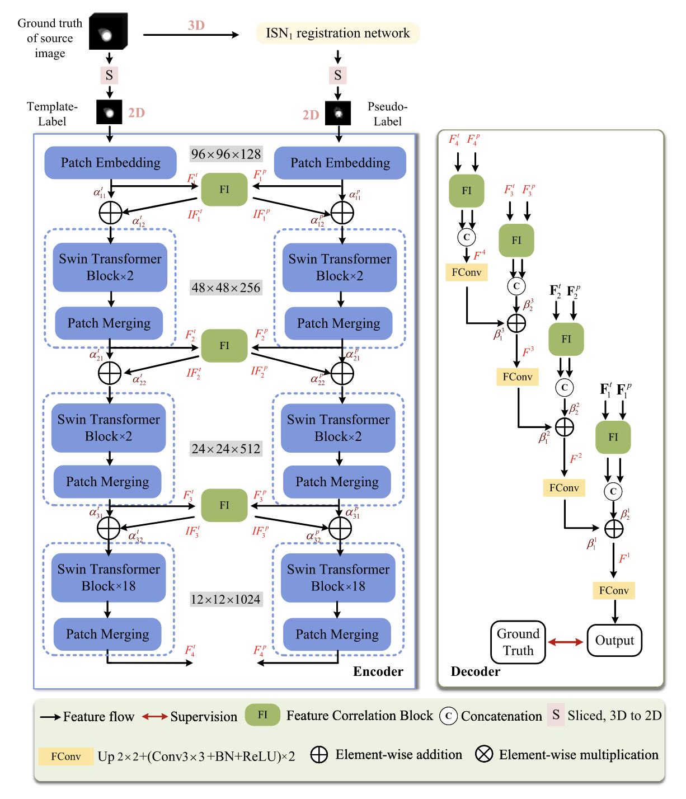

- **Encoder:**

  - Takes template label image and pseudo label image as input

  - Temlate label image is GT, pseudo label image is from registration model

  - The transformer is chosen for this architecture because of its strength in capturing long-range correlations, which are essential for representing both tissue morphology and spatial relationships between tissues.

  - The encoder first divides each input image into patches, embedding them into vectors of length 128. Then, multi-scale features are extracted using a modified Swin Transformer (Swin-B version) with three layers, generating hierarchical features for both template and pseudo-label images.

  - The features extracted from the two inputs undergo a comprehensive interaction through the FI block to generate the interacted features. These interacted features are then propagated back to their respective branches for further processing.

  - FIE(⋅) denotes the feature interaction operation through the proposed FI block in the encoder.

  - Fused by weighted addition operation.

- **Decoder:**

  - Take the hierarchical features extracted from the encoder and guide the network to apply the correct anatomical constraints from the template to the pseudo-label.

  - Feature Fusion: The decoder fuses features from both template and pseudo-label branches using an FI (Feature Interaction) block, creating combined features.

  - FID(⋅) denotes the feature fusion through the proposed FI block in the decoder.

  - Concatenation: The fused features are then merged (concatenated) to form a deep, shared feature.

  - This deep-level feature is combined with shallow-level features through up-sampling and convolution. This process gradually combines information from different layers to create a more detailed feature map at each level.

  - F Conv(⋅) comprises of an up-sampling operation, and two convolutional operations with 3 × 3 kernel size, each followed by a batch normalization layer and a rectified linear unit (ReLU) activation function.

  - βi1 and βi2 are two learnable parameters that adaptively weight the contributions of features during training.

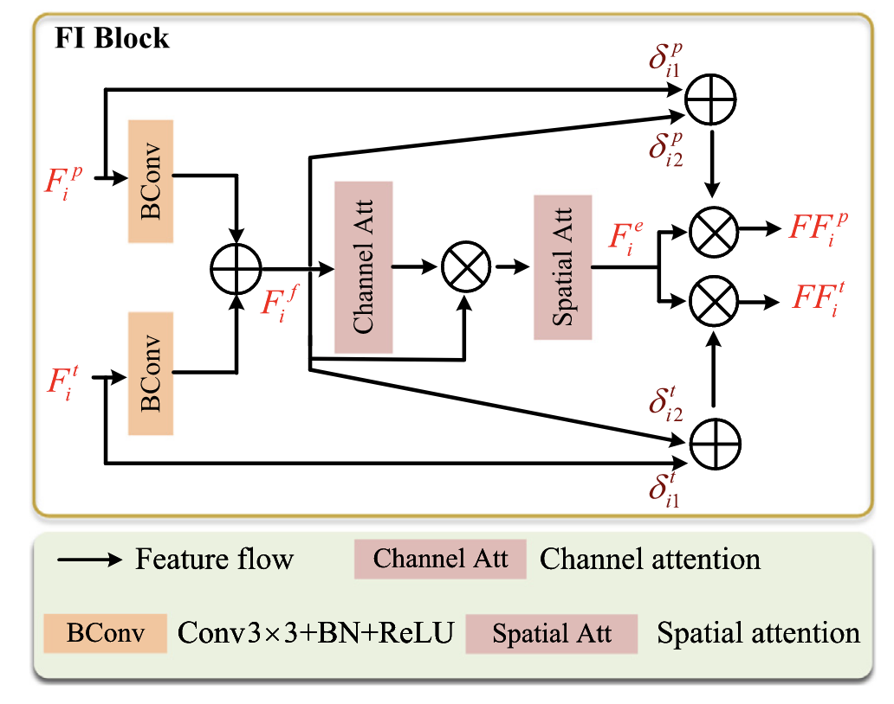

- **F1 Block:**

  - The FI block is also designed to facilitate information interaction between features at the same hierarchy and learn the correlation between them, thereby improving the ability to capture anatomical structures.

  - In encoder to enhance the semantic representation of label features

  - And also within the decoder to guide the generation of the cross-correlation feature.

  - 2 types of attention:

    - **Channel Attention** focuses on important channels in the features, enhancing relevant anatomical information.

    - **Spatial Attention** emphasizes important spatial regions in the features, allowing the model to focus on specific areas that are more relevant to the task.

  - Flow:

    - Fuse Ft and Fp

        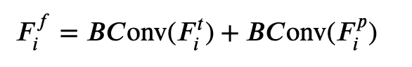

    - Generate spatio-channel attention map through two attention blocks

        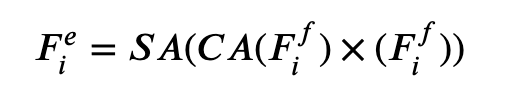
        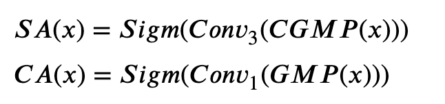

      - CGMP (⋅) is the global max pooling operation along channel direction

      - GMP (⋅) presents the global max pooling operation

    - Interacted Features

        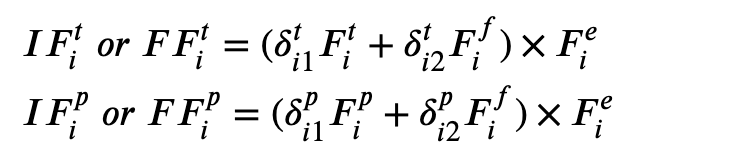

      - δ is learnable parameters of the features at ith hierachy in F1 Block

- **Output:**

  - Input image size is [H, W]

  - Output of the AnatSwin is [H, W, C], where C is the number of categories; C=4;

  - Background, LV, RV, MYO

- **Loss Function:**

  - Dice Loss

    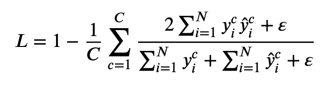

  - N = H × W

  - \( y^c_i\) is the predicted value of the \( c \)-th class for the $( i )-th pixel

  - \( \hat{y}^c_i \in \{0, 1\} \) represents the corresponding ground truth

    - i.e., when the pixel belongs to the \( c \)-th class, \( \hat{y}^c_i = 1 \); otherwise, \( \hat{y}^c_i = 0 \).

    - \( \varepsilon \) is a small positive number to maintain numerical stability.

- **Performance**

  - The FI block exhibits a significant impact on improving the segmentation accuracy of the morphologically irregular RV, while its effect on the more regular LV is less pronounced.

  - This discrepancy in performance can be attributed to the inherent differences in shape complexity across anatomies.

  - FI block demonstrates greater efficacy in boosting segmentation performance on cross-modal test images divergent from the training data modality compared to matched modalities.

- Lacking

  - convolutional operations are not included in the two branches of the encoder.

  - can introduce additional edge constraint branch

  - the model does not explicitly utilize anatomical structure information as prior knowledge.

  - incorporation of a multimodal loss function combined with other norm, such as low-rank

## [Learning with Explicit Shape Priors for Medical  Image Segmentation](https://arxiv.org/pdf/2303.17967)

(TMI 2023)

- **Inspiration:** 

  - The shape/size of ROI varies through out the 3D slices, requiring manual intervention (changee of point/box/mask prompt) in each slice. We propose a dynamic 3D shape prior that can dynamically adjust the shape prior for each slice (with different thinkness)

  - SUB - long dependencies
  - CUB - local shape
  - hierachical structure to capture the relationship between each slice, or a distribution or a map with concatenated shape priors from different slices.

- Explicit shape prior: 

  They show strong interpretability, which presents a rough localization for the regions of interest (ROIs).

- **How others do shape prior:**

  - Gaussian Mixture Model (GMM)

    consecutive mapping from Image space to Label space through a group of learnable Gaussian distributions. During training Expectation Maximization is used to iteratively update the learnable Gaussians. During inference, use the group of Gaussian distributions as shape prior as independent kernals. 

    But it is senstitive to noise and packground, it largely depend on the initial setting of the EM algorithm

  - Point Distribution Model (PDM)

    represent the mean geometry of a shape and some statistical modes of geometric variation inferred from a training set of shapes

  - Active Shape Model (ASM)

    statistical model of the object shape that iteratively deforms to fit an example of the object in a new image. The shapes are constrained by the point distribution model to vary in ways seen in a training set of labeled examples.

  - Active Appearance Model (AAM)

    matching a statistical model of object shape and appearance to a new image. Specifically, this algorithm uses the difference between the current estimate of appearance & shape and the target image to drive the optimization process.

- **Learnable Shape Prior:**

  - N-channel vector, each channel contains rich shape information for the specific class region

- **Main Architecture:**

  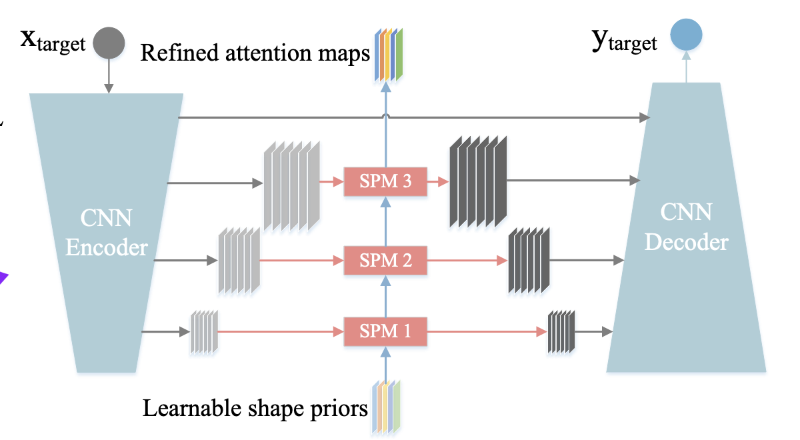

  - Model Input: Image and Explicit Shape prior (S)

  - Model Output: Predicted mask and the attention map generated by S

    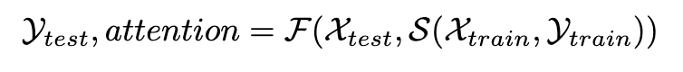

  - **Shape Prior Module (SPM)**:

    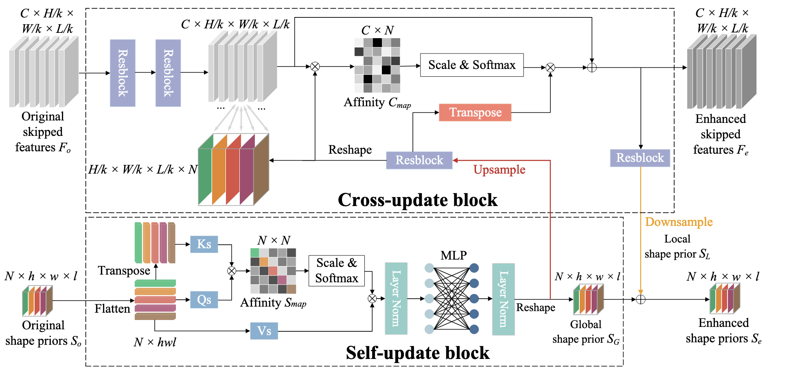

    - Plug and Play module, adaptable to other segmentation models

    - Input: Original Shape Prior $S_0$ and Original skipped features $F_0$

    - Output: Enhanced Shape Priors $S_e$ and Enhanced skipped features $F_e$

    - **QUESTION: where is $S_0$ coming from? -- Randomly initiated, and refined through training loop**

  - **Self-Update Block (SUB):** Model Long range dependency

    - model relations between inter-classes and generate global shape priors with interactions between N channels.

    - Dim for $S_0$ is N x Spatial Dimension
      
      - N: number of classes

      - spatial dimension depends on the batch size

    - affinity map of self-attention $S_{map}$ between N classes is constructed by:

      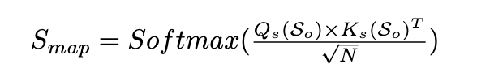
    
    - Global shape prior:

      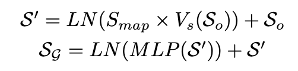

  - **Cross-Update Block (CUB):** Model local shape prior

    - SUB falls lack of inductive bias to model local visual structures and localize objects with various scales

    - CUB based on convolution injects inductive bias to SPM for  local shape priors with finer shape information.

    - Since convolutional features from the encoder have remarkable potentials to localize discriminative regions, authors attempt to interact original skipped features $F_o$ from the backbone with shape priors $S_o$

    - Upsample $S_o$ to the same resolution as $F_o$, since they bear different scales

    - Affinity map in cross attention:

      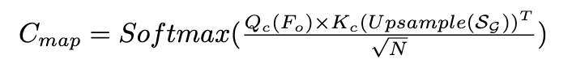

    - $C_{map}$ is a C × N matrix, which evaluates the relations between C channel feature maps $F_o$ and N -channel shape priors.

    - Enhanced skipped features:

      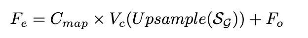

    - Local Shape Prior:

      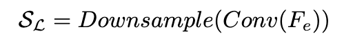

    - Enhanced shape prior:

      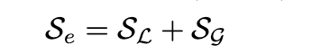

    
- Performance:

  Introduction of CUB leads to 1.09% ↑ average Dice score increase on ACDC.

  When SUB is applied to the structure of SPM, there is a further performance increase.

### Innovation

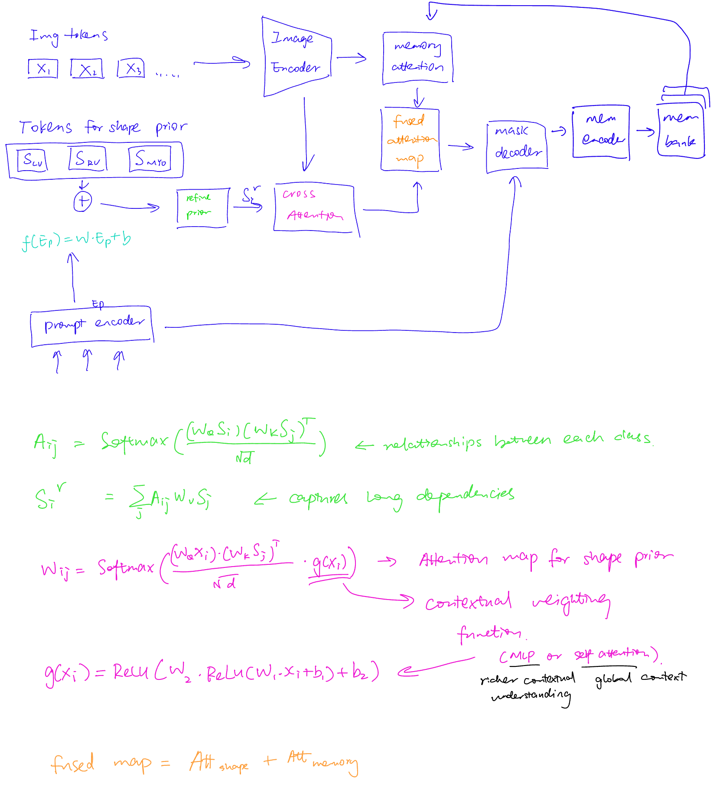

### Revision Notes

**Dimension of shape prior**

- Dimension of $S_0$: $N \times h \times w \times l$

- N is the number of classes

- Input batch size: $H \times W \times L$

- $h \times w \times l$ is $\frac{1}{16}$ of the patch size

**How does SPM work?**

- Learnable shape priors will generate refined attention maps with sufficient shape information under the guidance of conv envcoded features.

- At the same time, encoded features will generate more accurate segmentation via shape priors

- SPM will interact with multi-scale features, so, hierarchical encoded features before skip connections will be equipped with richer shape information through SPM

- Enhanced shape prior is made of global shape prior (generated through self-update block) and local shape prior (generated from cross-update block).

**SUB**

- Uses self-attention mechanism to model relationship between classes (LV, RV< MYO)

- Goal is to generate global shape prior that summarizes anatomical structure relationship across all classes

**CUB**

- Add local shape sensitivity, more detailed shapes

- Cross attention

- F: forward propagation during inference
- S: consecutive shape prior constructing the mapping between image space and label space (I and L)
- S is updated in training processs as image-GT pair varies. 

- **During training:**

    - The model learns shape priors by seeing many images and their correct labels.

    - The shape prior function SS learns how image space relates to label space.

    - During training, the model doesn't just learn how to map images to segmentation masks — it also learns a set of parameters (called shape priors) that capture what each class (like an organ or structure) should typically look like.

  - These parameters:

      - Are stored as embeddings or feature maps (e.g., one for each class)

      - Are learned just like weights in a neural network

      - Get updated during training as the model sees more image-label pairs

      - Are fixed after training and reused during inference to help guide predictions

- **During testing:**

    - These shape priors are fixed and reused.

    - They help focus on important areas (like organs) and ignore background.

- **How are they used to guide segmentation**

  - shape prior as attention maps

    - From the shape priors, model builds an affinity map ($S_{map}$ and $C_{map}$)

    - These attention maps are used to highlight important regions and supress background

  - Enhance feature maps

    - use attention weights, model enhance feature maps ($F_{e}$)

    - $F_{e}$ is updated from guidance of shape prior $S_{G}$

  - Generating local shape priors

    - With both global shape knowledge and local image cues, $S_e$ is used to guide the decoder to generate anatomically plausible segmentation masks.

- **What changes when we plug in SPM?**

  - Initialized a set of learnable parameters (shape prior embeddings), which are trained alongside the main network.

  - For UNet, encoded features are not passed directly to decoder, but instead, refined shape priors and enriched features are passed to the decoder -> decoder is now working with anatomically aware features.

  - During training, the loss between prediction and ground truth updates the shape priors and attention maps indirectly — helping them become smarter at guiding segmentation.

- **During inference phase, what does SPM affect?**

  - Normally, an image is passed, model runs forward pass through encodder, skip connection and decoder, then produce segmentation mask.

  - Now:

    - Pass an image
    - encoder extracts feature
    - learned shape prior are used to:
      - generate global shape priorvisa SUB
      - interact with iamge feature via CUB
      - get new enhanced feature and enhanced shape prior
    - Shape aware features are passed to decoder instead of skip connection features
    - Decoder use these "new" features to produce final segmentation mask
    - enhanced shape prior helps refined the features during attention process, but it is not directly passed to decoder.

## [Anatomy-Guided Pathology Segmentation](https://arxiv.org/pdf/2407.05844)

(MICCAI 2024)

## [Cardiac Segmentation With Strong  Anatomical Guarantees](https://arxiv.org/pdf/2006.08825)

(TMI 2020)

