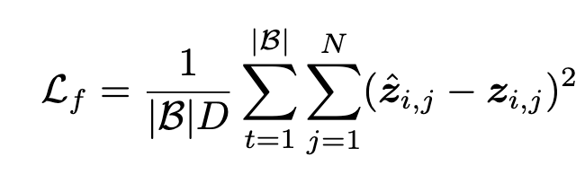
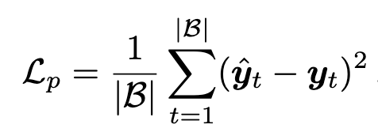
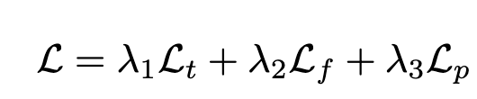
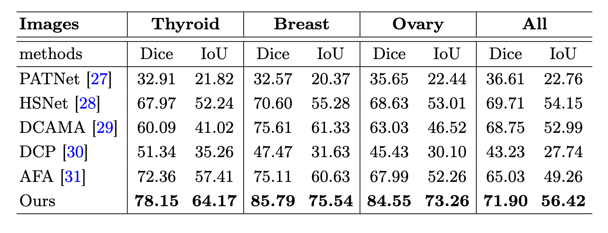
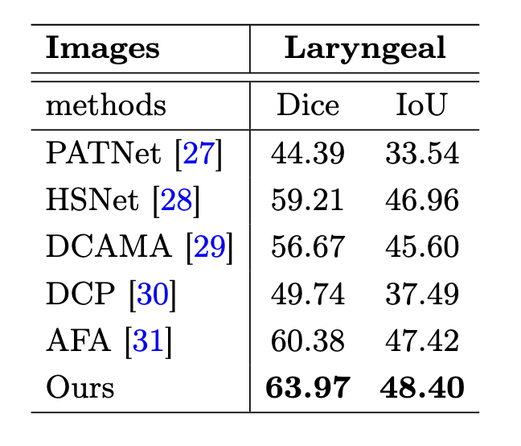
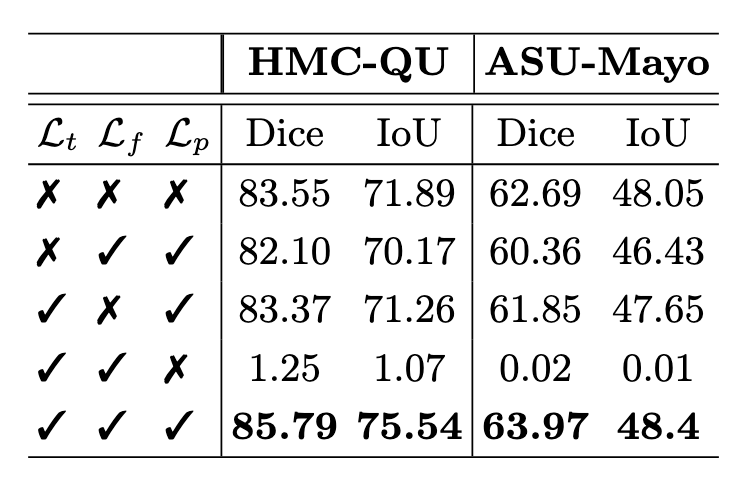
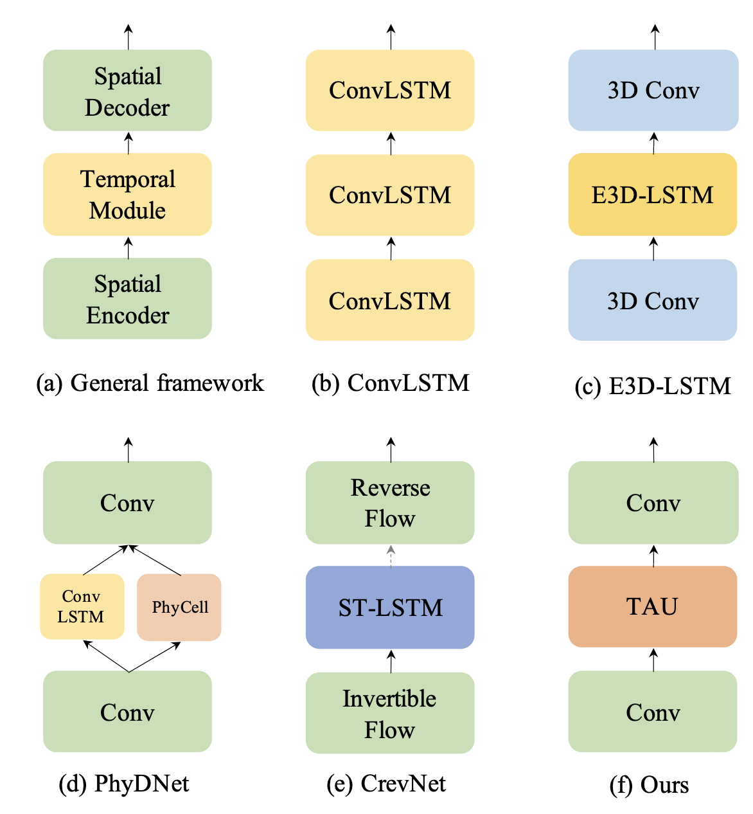
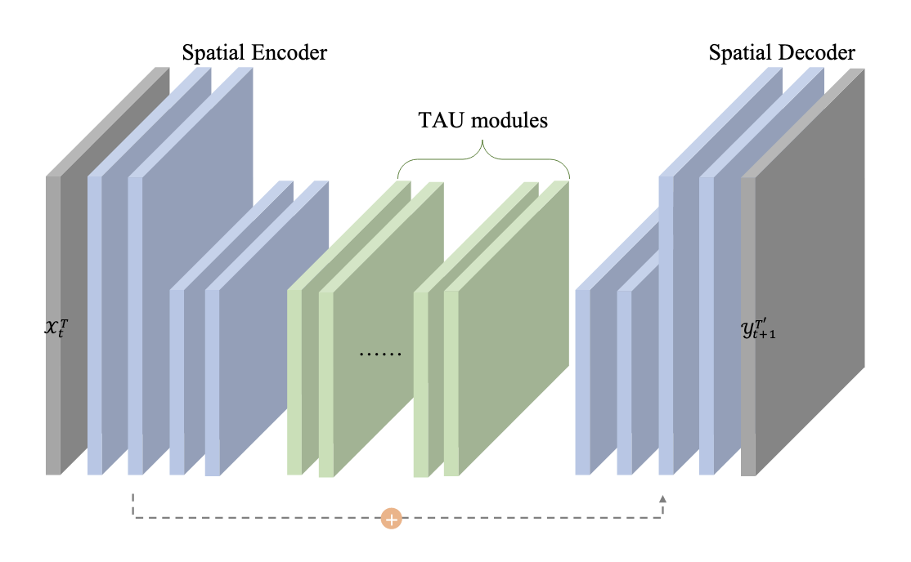
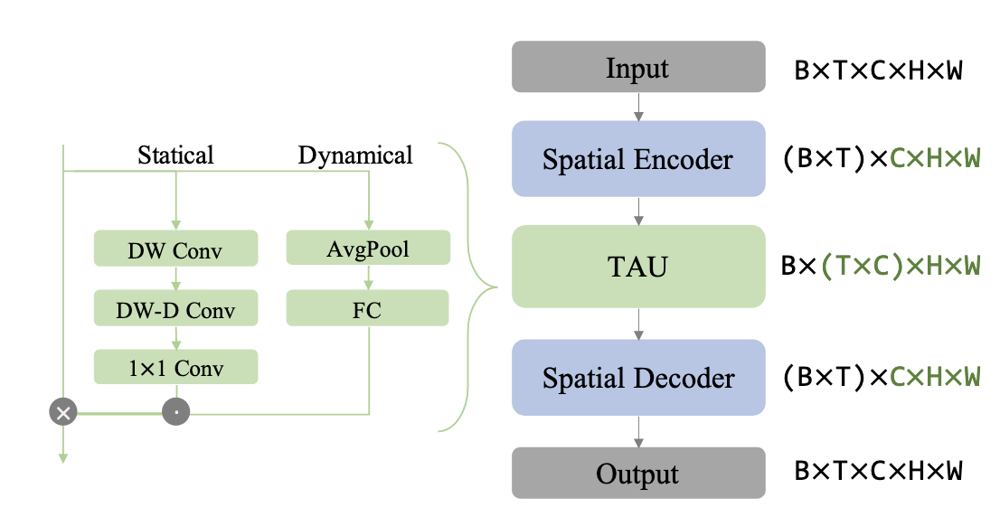
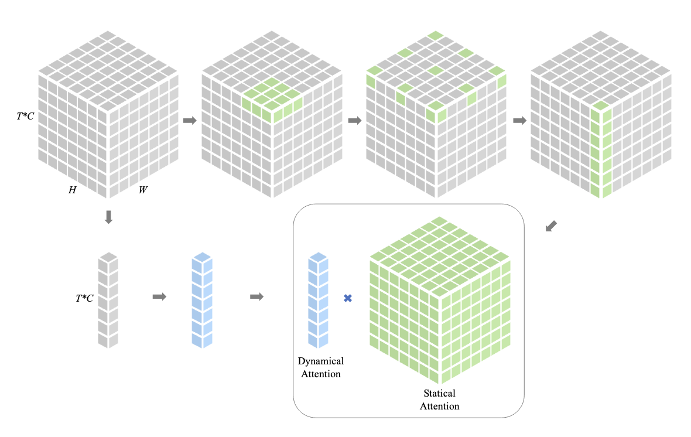

<!-- @import "[TOC]" {cmd="toc" depthFrom=1 depthTo=6 orderedList=false} -->

<!-- code_chunk_output -->

- [Reducing Annotation Burden: Exploiting Image Knowledge for Few-Shot Medical Video Object Segmentation via Spatiotemporal Consistency Relearning](#reducing-annotation-burden-exploiting-image-knowledge-for-few-shot-medical-video-object-segmentation-via-spatiotemporal-consistency-relearninghttpspapersmiccaiorgmiccai-2024paper3024_paperpdf)
- [Temporal Attention Unit: Towards Efficient Spatiotemporal Predictive Learning](#temporal-attention-unit-towards-efficient-spatiotemporal-predictive-learninghttpsarxivorgpdf220612126)
- [Domain Adaptive Video Segmentation via Temporal Consistency Regularization](#domain-adaptive-video-segmentation-via-temporal-consistency-regularizationhttpsopenaccessthecvfcomcontenticcv2021papersguan_domain_adaptive_video_segmentation_via_temporal_consistency_regularization_iccv_2021_paperpdf)
- [Domain Adaptive Video Segmentation via Temporal Pseudo Supervision](#domain-adaptive-video-segmentation-via-temporal-pseudo-supervisionhttpsarxivorgpdf220702372)
- [SAM2Long](#sam2longhttpsarxivorgpdf241016268)

<!-- /code_chunk_output -->

## [Reducing Annotation Burden: Exploiting Image Knowledge for Few-Shot Medical Video Object Segmentation via Spatiotemporal Consistency Relearning](https://papers.miccai.org/miccai-2024/paper/3024_paper.pdf)

(MICCAI 2024)

- The goal is to segment a medical video given sparse annotations—only a few frames (e.g. the first) have ground truth masks, along with abundant labeled images.

- Training with labeled image, testing with unseen data 

- Both training and testing are done in episodes. Each episode contains 2 parts:

    - **support set (S):** first few frames of the video, each with an image and its object mask

        $( S = {(s_i, m_i)}_{i=1}^N)$

        $s_i$ and $m_i$ represent the i-th support image and its ground truth mask

    - **query set (Q):** The following frames, where the model has to predict the object’s location.

        $( Q = {(q_k, y_k)}_{k=1}^K)$

        $q_k$ and $y_k$ denote the k-th query image and the corresponding annotation mask

    - model segments $q_k$ guided by S

- **Overall Flow:**

    - **First Part**: Pre-trained model identify useful features from support images

    - use these features to create segmentation on query images -> roughly locate the target object

    - Then it refines these to get more accurate segmentation

    - **Second Part**: focus on spatiotemporal consistency

    - This uses the assumption: object in video frames are similar from one frame to the next frame (temporal continuity)

    - model “relearns” by using these frame-to-frame similarities to improve its accuracy over time

- Learning Few-Shot Segmentation with Images

    - The network has three main parts:

        - **Pseudo Mask Generation Module** - Creates rough outlines of the target object in the query image.

        - **Cross-Resolution Feature Fusion Module** - Combines details from support and query images to refine the segmentation.

        - **Segmentation Head** - Final layer that produces the exact segmentation mask.

    - extract visual features from support and query images using a pre-trained backbone

    1. **pseudo mask generation module**

        - for Coarse Object Localization

        - they measure the cosine similarity between query and support features

            

        - F() is backbone that can extract features

        - the element-wise multiplication isolates and emphasizes only the features of the target object in the support image

        - then normalize $p_k$ to the range of [0, 1] using min-max normalization

    2. **cross resolution feature fusion module**

        - facilitates interaction between query features and support features along with pseudo masks at multiple scales, thereby preserving fine image details and precise localization cues

        

        - up(·) upsamples the pseudo mask
        
        - G denotes the first half of the backbone network -> retain finer details
        
        - Concat(·) represents channel-wise concatenation

        -  Conv: mixes the channels to generate a fused feature
        
        - To capture finer details, the network uses a heavy neck module (adapted from GiraffeDet), which processes these fused features at different scales. This multi-scale approach helps the model better handle variations in object size and appearance.

    3. **segmentation head**

        3 × 3 convolutional layer followed by a 1 × 1 convolution with softmax, to predict segmentation masks

- Spatiotemporal Consistency Relearning for Videos

    - **Temporal Attention Unit** (detailed in next paper)

    - placed between the cross-resolution feature fusion module and segmentation head of the trained image model, designed to capture connections between frames.

    - **temporal consistency regulation**

        - utilize cosine similarity to regularize the consistency of features of consecutive frames. This serves to capture temporal relationships without supervision while improving segmentation.

        

        - Lt​ is a scalar value that represents the temporal consistency loss for a batch of consecutive frames.

        - Lt​ is minimized during training to ensure that the model learns smooth transitions across frames, enhancing temporal consistency without requiring additional labels.
    
    - **feature and prediction consistency constraint**

        In the relearning phase, the model's paramters are updated to handle video data better. But this would cause model’s behavior diverge from what it learned in the initial training, potentially reducing its performance on video frames. To keep the model stable, the two constraints are introduced:

        **feature consistency constraint**

        ensures that the features (internal representations) produced by the model during relearning are still similar to those from the initially trained model. 

        - $z_{i,j}$ feature vector from the original model (cross resolution feature fusion module)

        - $\hat{z}_{i,j}$ feature vector from the relearning model

        

        - This squared difference is averaged over all feature vectors $N$ and all inputs in a batch $∣B∣$

        - $∣B∣$ is the batch size (number of frames), and $D$ is a scaling factor

        **prediction consistency constraint**

        - $y_{t}$ is the segmentation mask predicted by the original model for a frame

        - $\hat{y}_t$ is the segmentation mask predicted by the relearning model for the same frame

        

        - This difference is averaged across all frames in the batch $∣B∣$

        **overall objective for relearning**

        - relearning model will have weights initialized and taken from original model (excluding temporal attention unit)

            - this initialization gives the relearning model a strong starting point because it can leverage knowledge from the image-based training

        - segmentation head is fixed, and all other parameters are trainable

            - ensures that the relearning focuses on adapting the features for video consistency without altering the head’s functionality, preserving the original image-based segmentation accuracy

        - overall objective funtion:

        

        - $L_t$​: The temporal consistency loss, which encourages smooth transitions and consistency between consecutive video frames

        - $L_f$​: The feature consistency loss, which ensures that features generated by the relearning model remain similar to those from the original model

        - $L_p$​: The prediction consistency loss, which keeps the final segmentation output from the relearning model similar to the original model’s output

        - $λ_1$​, $λ_2$​, and $λ_3$​: Hyperparameters that control the importance of each loss term. By tuning these values, it balance how much the model focuses on temporal, feature, and prediction consistency

- Experiment:

    Dataset used:

    - BUSI: Breast Ultrasound Images
    - MMOTU: Multi-Modality Ovarian Tumor Ultrasound
    - TN3K: Thyroid Nodule 3000
    - DDTI: Digital Database Thyroid Image
    - Laryngeal Endoscopic: Laryngeal Endoscopic Images
    - HMC-QU: Heart Motion Challenge - Quality Ultrasound
    - ASU-Mayo: ASU-Mayo Clinic Colonoscopy Video

    Comparison for HMC-QU ultrasound video dataset:
    

    Comparison for ASU-Mayo endoscopic video dataset:

    

    Ablation Study:

    

## [Temporal Attention Unit: Towards Efficient Spatiotemporal Predictive Learning](https://arxiv.org/pdf/2206.12126)

(CVPR 2022)

- TAU: a model that uses visual attention mechanism to parallelize the temporal evolution without the recurrent structure

- $t$: The current time/frame

- $T$: The length (or number) of past frames used as input to predict the future frames

- $t-T+1$: the starting point of the input sequence of frames leading up to the current time t when the model is making predictions

- Architecture Overview:

1. **Spatial Encoder**: has four basic 2D convolutional layers that process the input images to capture spatial details

2. **Spatial Decoder**: has four layers, but they are “transposed” convolutions

3. A **residual connection** links the first layer in the encoder to the last layer in the decoder

4. In between the encoder and decoder, there are multiple **TAU modules**. They can efficiently learn both spatial-dependent and temporal-dependent features without recurrent architectures.

- Detailed Schema:

This allows the model to understand both the spatial structure of each frame and how these structures change over time.

- Input:

     **Batch of Video Tensors**: a batch of video sequences represented as a tensor:

    - B is the batch size (number of videos).
    - T is the number of frames (time steps) in each video.
    - C is the number of channels (e.g., RGB channels).
    - H and W are the height and width of each frame.

        $B \in \mathbb{R}^{B \times T \times C \times H \times W}$

- **Spatial Encoder and Decoder Reshaping**

   - To focus on spatial correlations within each frame.
   - Reshaping:
     
     $B \times T \times C \times H \times W \rightarrow (B \times T) \times C \times H \times W$
     
     - treat each frame in every video as an independent image in the batch.
     - This allows the spatial encoder and decoder to process frames individually.

- **Temporal Module Reshaping**

   - To focus on temporal correlations across frames.
   - Reshaping:
    
        $B \times T \times C \times H \times W \rightarrow B \times (T \times C) \times H \times W$
    
     - combine the time and channel dimensions.
     - This arranges the sequence of frames along the channel dimension, effectively stacking them for temporal processing.

## [Domain Adaptive Video Segmentation via Temporal Consistency Regularization](https://openaccess.thecvf.com/content/ICCV2021/papers/Guan_Domain_Adaptive_Video_Segmentation_via_Temporal_Consistency_Regularization_ICCV_2021_paper.pdf)

(ICCV 2021)

## [Domain Adaptive Video Segmentation via Temporal Pseudo Supervision](https://arxiv.org/pdf/2207.02372)

(ECCV 2022)

## [SAM2Long](https://arxiv.org/pdf/2410.16268)

(arXiv Preprint 2024)
