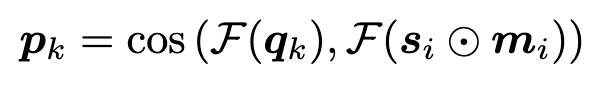
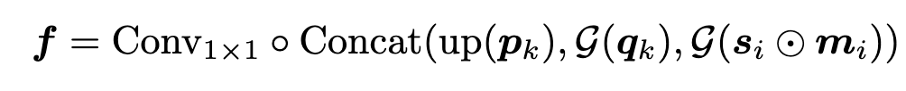
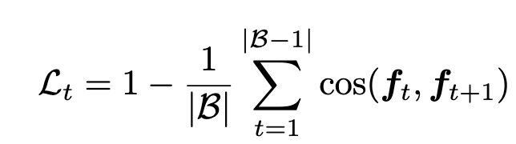

## [Reducing Annotation Burden: Exploiting Image Knowledge for Few-Shot Medical Video Object Segmentation via Spatiotemporal Consistency Relearning](https://papers.miccai.org/miccai-2024/paper/3024_paper.pdf)

(MICCAI 2024)

- The goal is to segment a medical video given sparse annotations—only a few frames (e.g. the first) have ground truth masks, along with abundant labeled images.

- Training with labeled image, testing with unseen data 

- Both training and testing are done in episodes. Each episode contains 2 parts:

    - **support set (S):** first few frames of the video, each with an image and its object mask

        \( S = \{(s_i, m_i)\}_{i=1}^N \)

        $s_i$ and $m_i$ represent the i-th support image and its ground truth mask

    - **query set (Q):** The following frames, where the model has to predict the object’s location.

        \( Q = \{(q_k, y_k)\}_{k=1}^K \)

        $q_k$ and $y_k$ denote the k-th query image and the corresponding annotation mask

    - model segments $q_k$ guided by S

- Network consist of 3 main parts:

    - extract visual features from support and query images using a pre-trained backbone

    1. **pseudo mask generation module**

        - for Coarse Object Localization

        - they measure the cosine similarity between query and support features

            

        - F() is backbone that can extract features

        - then normalize $p_k$ to the range of [0, 1] using min-max normalization

    2. **cross resolution feature fusion module**

        - facilitates interaction between query features and support features along with pseudo masks at multiple scales, thereby preserving fine image details and precise localization cues

        

        - up(·) upsamples the pseudo mask
        
        - G denotes the first half of the backbone network 
        
        - Concat(·) represents channel-wise concatenation

    3. **segmentation head**

        3 × 3 convolutional layer followed by a 1 × 1 convolution with softmax, to predict segmentation masks

- Spatiotemporal Consistency Relearning for Videos

    **Temporal Attention Unit**

    - placed between the cross-resolution feature fusion module and segmentation head of the trained image model, designed to capture connections between frames.

    - utilize cosine similarity to regularize the consistency of features of consecutive frames. This serves to capture temporal relationships without supervision while improving segmentation.

    - temporal consistency regulation

        

        - Lt​ is a scalar value that represents the temporal consistency loss for a batch of consecutive frames.

        - Lt​ is minimized during training to ensure that the model learns smooth transitions across frames, enhancing temporal consistency without requiring additional labels.
    
    

## [SAM2Long](https://arxiv.org/pdf/2410.16268)

(arXiv Preprint 2024)

## [Domain Adaptive Video Segmentation via Temporal Consistency Regularization](https://openaccess.thecvf.com/content/ICCV2021/papers/Guan_Domain_Adaptive_Video_Segmentation_via_Temporal_Consistency_Regularization_ICCV_2021_paper.pdf)

(ICCV 2021)

## [Domain Adaptive Video Segmentation via Temporal Pseudo Supervision](https://arxiv.org/pdf/2207.02372)

(ECCV 2022)
