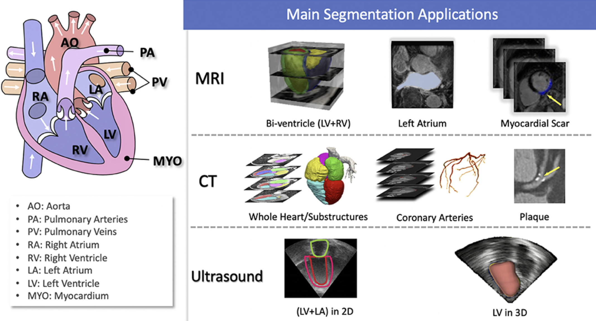

# CardiacSeg

## List of Paper

- [MaPLe: Multi-modal Prompt Learning - CVPR2023](https://openaccess.thecvf.com/content/CVPR2023/papers/Khattak_MaPLe_Multi-Modal_Prompt_Learning_CVPR_2023_paper.pdf)

- [A survey on shape-constraint deep learning for medical image segmentation - BME2021](https://arxiv.org/abs/2101.07721)

- [Learning with Explicit Shape Priors for Medical  Image Segmentation - TMI2024](https://arxiv.org/pdf/2303.17967)

- [Shape-Aware Deep Neural Networks for Biomedical Image Segmentation - ICCV2021](https://openaccess.thecvf.com/content/ICCV2021/papers/Cao_ShapeConv_Shape-Aware_Convolutional_Layer_for_Indoor_RGB-D_Semantic_Segmentation_ICCV_2021_paper.pdf)

- [Anatomically Constrained Neural Networks (ACNN): Application to Cardiac Image Enhancement and Segmentation - TMI2018](https://ieeexplore.ieee.org/stamp/stamp.jsp?tp=&arnumber=8051114)
## Timeline

**Oct/30 Update:**

- Results of SAM2 on 4 datasets

- Inspiration from MICCAI 2024 paper

- Purpose of cardiac segmentation in clinical application; applicable medical scenario

## To be explored

- Purpose of cardiac segmentation in clinical application; applicable medical scenario

- MICCAI 2024 paper on SAM

- LORA on fine tuning

- Metric that measure accuracy for edges

- CT set with normal patients (no CHD)

- Feasible method for shape prior for anatomically aware block

- Design of loss function to add shape constraint in the training loop

## Experiments to be done

- SAM2 on four datasets

- Comparison Test:

	- MedSAM
	
	- MedSAM2
	
	- SAM

---

**Reference Structure**

 (https://doi.org/10.3389/fcvm.2020.00025)